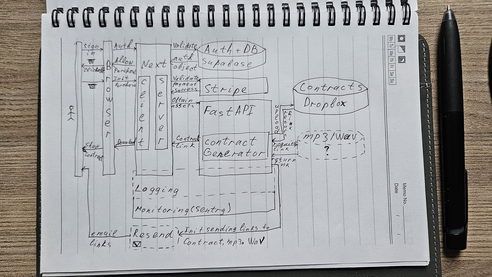

This application is a license store of the music compositions done by the producer [Quodis](https://www.beatstars.com/quodis)

Second part of the application that is responsible for generating license contracts according to the purchase is a FastAPI app located at https://github.com/truvor/contract-handler

## Getting Started

Basic commands to start:
```bash
# Run the development server
next dev

# Build the application for production
next build

# Start the production server
next start
```

Open [http://localhost:3000](http://localhost:3000) with your browser to see the result.

## Sequence diagram of the designed system

